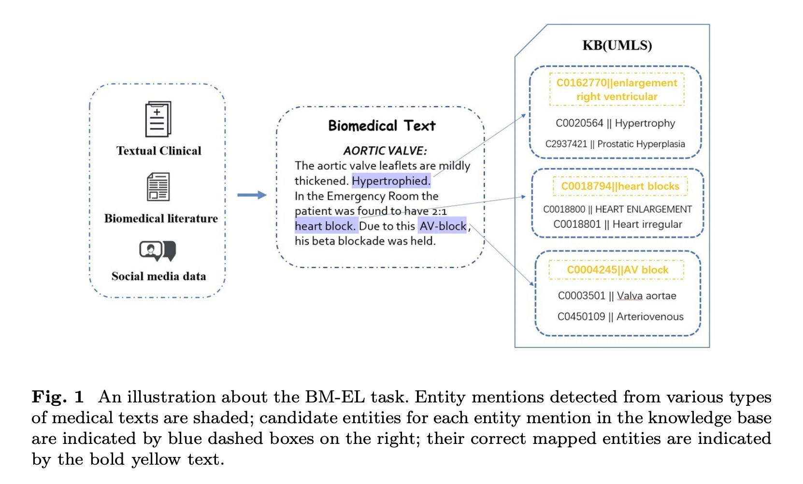
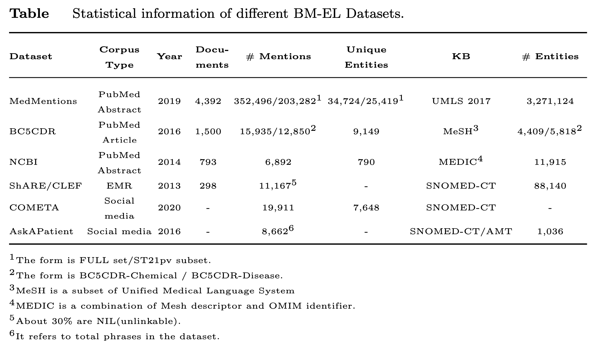
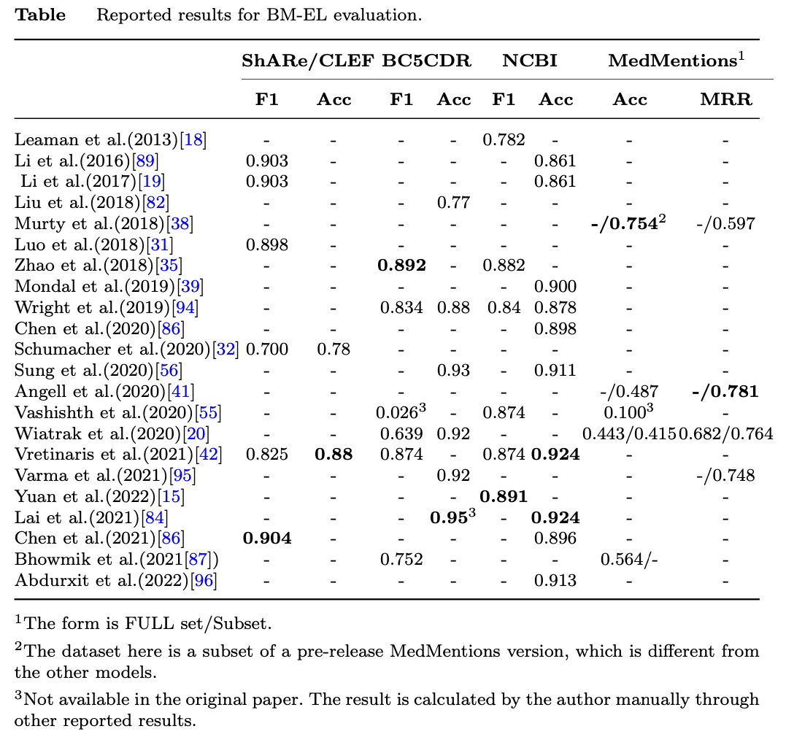
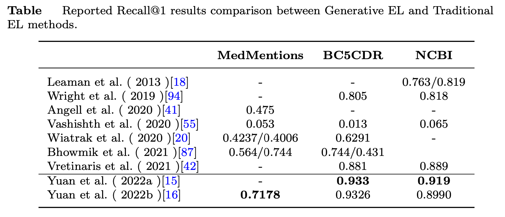

# BM-EL-Survey
Repository for paper "Biomedical Entity Linking: A Survey".

> This repository is still under constructing.

## Abstract

Biomedical Entity Linking (BM-EL) task, which aims to match biomedical mentions in articles to entities in a certain knowledge base (e.g., the Unified Medical Language System), draws dramatic attention in recent years. BM-EL can help to disambiguate medical terms and link to rich semantic information in the biomedical knowledge base, which can act as an essential means for many downstream applications.
Although entity linking tasks have been investigated in the general domain and achieved great success, many challenges remain in the biomedical field, for instance,  highly complex terminology, less training data, and entity ambiguity.
In this survey, we categorize BM-EL methods into rule-based, machine learning, and deep learning models according to the development of the model paradigm and provide a comprehensive review of each approach.
In-depth study of current BM-EL efforts, we group the model architectures into four categories: joint entity recognition and linking, graph-based global entity disambiguation, cross-lingual architectures, and model-efficiency improvement.
We further introduce six well-established datasets that are commonly used for BM-EL tasks. Furthermore, we present a comparison of the different methods and discuss their advantages and disadvantages.
Finally, we discuss the limitations of existing methods for BM-EL and discuss promising future research directions.

## Dataset

According to different corpus sources, we classify the datasets commonly used for BM-EL tasks into the following types: biomedical literature, EMRs, social media datasets, etc. These corpora have various text features. For example, literature has more complex proper nouns, more abbreviations in electronic medical records, and more colloquial expressions in social media data. We summarize the statistical information of different datasets in the table below and introduce their details as follows.

### MedMentions

> Mohan, S., Li, D.: MedMentions: A Large Biomedical Corpus Annotated with UMLS Concepts. arXiv (2019)

It is one of the largest BM-EL datasets  available, and includes 4392  English abstracts from PubMed with contains 352,496 mentions. Each mention is linked to a unique entity in the UMLS knowledge base. Researchers usually use the St21pv subset, including fewer mentions, CUIs, and a total of 21 semantic types of entities. For the partitioning of the dataset, researchers follow the official 60%/20%/20% ratio to obtain the train/dev/test set.

### Biocreative V CDR dataset

> Li, J., Sun, Y., Johnson, R.J., Sciaky, D., Wei, C.-H., Leaman, R., Davis, A.P., Mattingly, C.J., Wiegers, T.C., Lu, Z.: BioCreative V CDR task corpus: a resource for chemical disease relation extraction. Database 2016 (2016)

It is widely used in Named Entity Recognition and EL tasks. It is a corpus of the biomedical literature derived from 1500 English language articles in PubMed, containing 4409 annotated chemicals and 5818 annotated disease entities. All the mentions in the dataset are linked to MeSH (a subset of UMLS). The articles are equally distributed into train/dev/test sets.

### NCBI disease corpus

> Do ̆gan, R.I., Leaman, R., Lu, Z.: Ncbi disease corpus: A resource for dis- ease name recognition and concept normalization. Journal of Biomedical Informatics 47, 1–10 (2014)

It is an extensively used entity-linking dataset obtained from biomedical literature. The dataset contains 793 abstracts of the biomedical literature, where each mention is linked to MEDIC ontology. Notably, in the NCBI dataset, each annotation mention is linked to an entity in the knowledge base. A typical dataset split division is 593/100/100.

### ShARe/CLEF eHealth Challenge corpus

> Pradhan, S., Elhadad, N., South, B.R., Martinez, D., Christensen, L.M., Vogel, A., Suominen, H., Chapman, W.W., Savova, G.K.: Task 1: Share/- clef ehealth evaluation lab 2013. In: CLEF (Working Notes), vol. 1179 (2013)

Unlike the datasets mentioned above, ShARe/CLEF is an electronic medical-record dataset containing 298 clinical reports. In each report, the disorder mention is linked to the corresponding entity in the SNOMED-CT knowledge base. If  no corresponding entity exists, it is labeled as  “CUI-less”  (about 28.2% in the training set and 32.7% in the test set). The dataset is separated into training (199) and test (99) subsets.

### COMETA and AskAPatient

> COMETA: Basaldella, M., Liu, F., Shareghi, E., Collier, N.: COMETA: A Corpus for Medical Entity Linking in the Social Media. arXiv (2020)
>
> AskAPatient: Limsopatham, N., Collier, N.: Normalising medical concepts in social media texts by learning semantic representation. In: Proceedings of the 54th Annual Meeting of the Association for Computational Linguistics (volume 1: Long Papers), pp. 1014–1023 (2016)

COMETA and AskAPatient are datasets obtained from social media and forums. More types of entity-linking datasets in the biomedical domain are attracting researchers’ interest. Unlike English literature and electronic medical-record datasets, as the general public does not have a rich professional background, their descriptions are relatively vague and imprecise. Their language styles are also relatively uncritical, posing new challenges for BM-EL models.

## Model Comparison

We present a series of representative BM-EL methods and collect experimental results from the original papers, and summarized in the tables below.

Detailed analysis please refer to the paper.

